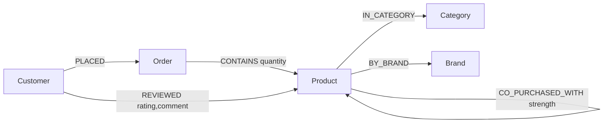
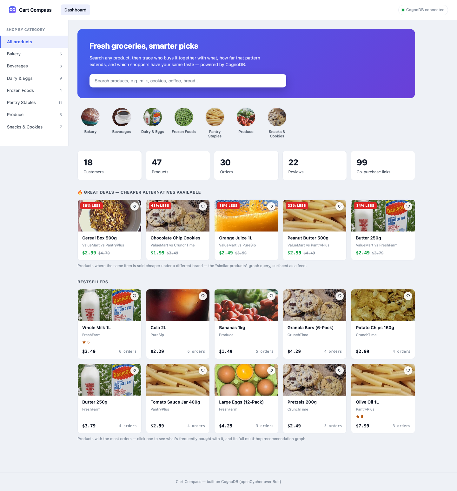
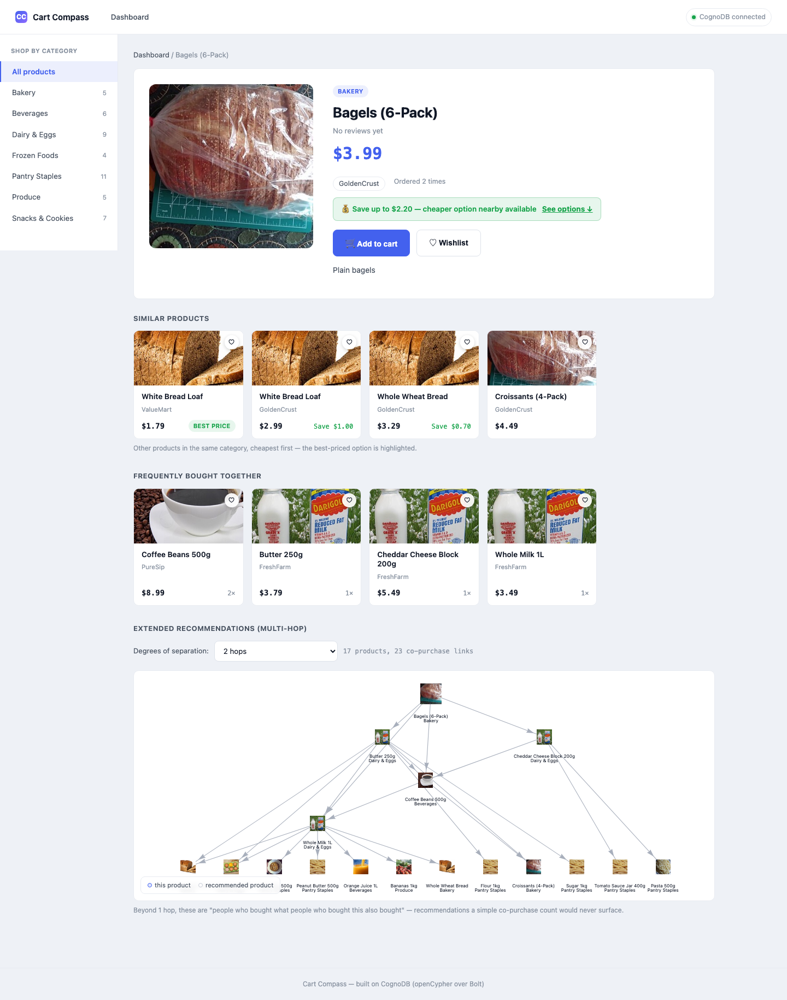
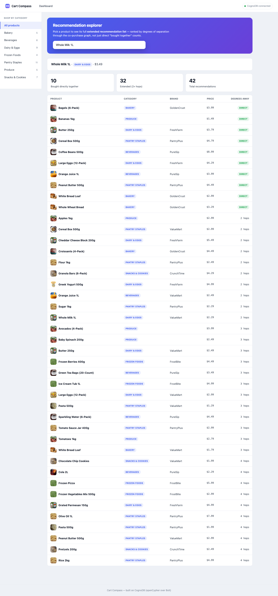
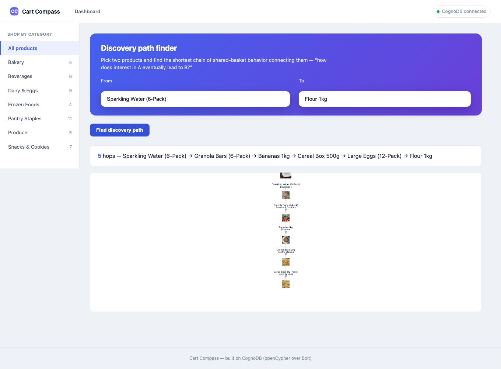
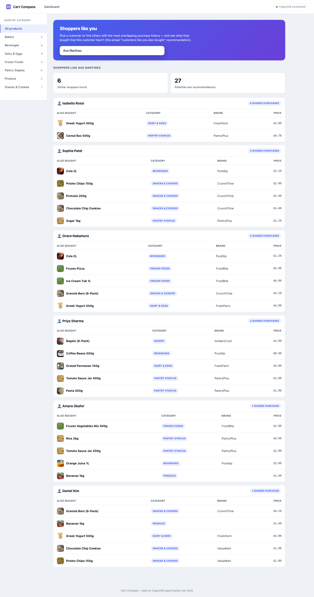

# Cart Compass

A graph-native recommendation engine for a grocery store: multi-hop "customers who bought this
also bought" recommendations, similar-product/best-price suggestions, explainable discovery paths
between products, and shared-purchase-history customer similarity. Built in Java (Spring Boot) on
**CognoDB**, a managed graph database that speaks openCypher over Bolt.

> Built as a take-home assignment for Wexa AI. Use case, data model, and code are my own.

---

## 1. The use case

Picture a grocery store's catalog — milk, eggs, bread, cookies, coffee, produce — and two things a
shopper actually wants when they land on a product page: **"what goes with this?"** and **"is
there a cheaper version of this?"** The classic recommendation query — "customers who bought X also
bought Y" — only answers the first, and only one degree deep. The more interesting question is the
*second-degree* one: **what did customers buy who bought the things that customers who bought X
also bought?** That's "recommendations of recommendations" — the kind of extended, explainable
discovery a plain co-purchase count can't surface, and it's naturally a multi-hop graph traversal,
not a lookup.

Cart Compass models a small grocery catalog (products, categories, brands, customers, orders,
reviews) and, from the real order data, derives a co-purchase graph at seed time — then traverses
it to answer four things a relational schema makes awkward: extended multi-hop recommendations,
same-category "similar product, better price" suggestions, the shortest "discovery path" connecting
two products, and shared-purchase-history customer similarity ("shoppers like you").

### Why a graph database?

A relational schema *can* model customers, orders, and order line items — but the moment you go
past a single join, it stops being convenient:

- **Second-degree collaborative filtering** ("people who bought what people who bought X bought")
  needs the co-purchase pattern applied twice and de-duplicated against what's already been seen.
  In SQL that's a stack of self-joins on `order_items` (or a recursive CTE with a hand-picked depth
  cap) that has to be rewritten every time you want to go one degree further. In Cypher it's one
  variable-length pattern: `(seed)-[:CO_PURCHASED_WITH*1..4]-(rec)`.
- **Discovery paths are explainable.** Showing *why* two products are connected — the literal
  chain of shared purchases between them — is a `shortestPath()` query here. A matrix-factorization
  or embedding-based recommender can rank products but can't hand you the reasoning; a graph
  traversal can.
- **Customer similarity is a join through a *person*, not a foreign key** — "who else bought
  overlapping products, and what did they buy that this customer hasn't" is a shared-entity
  traversal that stays a single readable query here regardless of how many customers or products
  are involved, where the equivalent self-join across `order_items` against itself gets expensive
  and awkward fast as the customer base grows.
- **Similar-product/best-price suggestions are a 2-hop traversal** (`Product -> Category <-
  Product`) that's trivial to express and trivial to extend (add another hop through `Brand` for
  "same brand, different size" without touching the shape of the query) - the equivalent SQL join
  on a `category_id` foreign key works for this one case, but stops being convenient the moment you
  want it chained with anything else, like the co-purchase graph above.
- Traversal cost in a native graph database is proportional to how much of the graph you actually
  touch (index-free adjacency), not the size of the whole dataset — so these queries stay fast as
  the catalog grows, where relational self-joins get slower with every added table pass.

None of this is exotic graph theory — it's the everyday shape of "who bought what, and what does
that imply", which is exactly what a graph database is for.

---

## 2. Data model



| Node | Key properties | Notes |
|---|---|---|
| `Customer` | `id`, `name`, `email`, `joinDate` | |
| `Product` | `id`, `name`, `description`, `price`, `sku` | |
| `Category` | `id`, `name` | e.g. Dairy & Eggs, Snacks & Cookies |
| `Brand` | `id`, `name` | optional — produce items (bananas, apples, ...) have no `BY_BRAND` edge |
| `Order` | `id`, `orderDate` | |

| Relationship | Direction | Notes |
|---|---|---|
| `(Customer)-[:PLACED]->(Order)` | customer → order | |
| `(Order)-[:CONTAINS]->(Product)` | order → product | line item |
| `(Product)-[:IN_CATEGORY]->(Category)` | product → category | |
| `(Product)-[:BY_BRAND]->(Brand)` | product → brand | |
| `(Customer)-[:REVIEWED {rating, comment, date}]->(Product)` | customer → product | |
| `(Product)-[:CO_PURCHASED_WITH {strength}]->(Product)` | product ↔ product | **derived**, not hand-authored — see below |

`CO_PURCHASED_WITH` is computed once at seed time directly from the order data:

```cypher
MATCH (o:Order)-[:CONTAINS]->(p1:Product), (o)-[:CONTAINS]->(p2:Product)
WHERE p1.id < p2.id
WITH p1, p2, count(DISTINCT o) AS strength
MERGE (p1)-[r:CO_PURCHASED_WITH]->(p2)
SET r.strength = strength
```

Every multi-hop recommendation query in the app traverses this one derived edge type — it's the
graph equivalent of a precomputed "frequently bought together" table, except here you can walk it
more than one hop.

---

## 3. Project structure

```
src/main/java/com/wexa/retailgraph/
  config/       CognoDbProperties, Neo4jConfig        – driver wiring, env-var based
                AuthProperties, AuthInterceptor, WebConfig – the login gate (below)
  controller/   REST controllers (thin, no business logic)
  service/      GraphQueryExecutor + one service per concern (Product, Recommendation,
                Customer, Stats) – every Cypher statement lives here, documented inline
                SessionStore – in-memory session tokens for the login
  dto/          Response records returned as JSON
  exception/    NotFoundException, DatabaseUnavailableException, UnauthenticatedException,
                GlobalExceptionHandler
  seed/         DataSeeder – the seed script, runs only with --seed
src/main/resources/
  application.yml       – all config from env vars, nothing hardcoded
  seed/seed-data.json   – the seed dataset (products, customers, orders, reviews)
  static/                – the frontend: plain HTML/CSS/JS, no build step, no framework
```

No ORM, no query builder — every Cypher statement in `service/` is a plain, parameterized string
you can read top to bottom next to the DTO it fills in.

---

## 4. Set up CognoDB Cloud

1. Sign up at [console.cognodb.com/signup](https://console.cognodb.com/signup) (no credit card
   needed for the free tier).
2. Create a free **c0** instance, pick a region, wait ~1 minute for it to provision.
3. Copy the Bolt URI (`bolt+s://<instance-id>.databases.cognodb.cloud`) and the generated
   password for user `cognodb` — **the password is shown once**, save it immediately.

---

## 5. Run it locally

**Prerequisites:** Java 17+, Maven 3.9+.

```bash
# 1. Configure credentials (never commit these — .env is gitignored)
cp .env.example .env
# edit .env with your COGNODB_URI / COGNODB_PASSWORD

# 2. Load the seed data (idempotent — safe to re-run)
export $(grep -v '^#' .env | xargs)
./scripts/seed.sh
# add --reset first if the instance already has different data in it:
#   ./scripts/seed.sh --reset

# 3. Run the app
mvn spring-boot:run
# → http://localhost:8080
```

Or with Docker:

```bash
docker build -t retailgraph .
docker run -p 8080:8080 --env-file .env retailgraph
```

If CognoDB is unreachable, the app still starts and serves the UI — every page shows a
"can't reach the database" banner instead of failing to load (see `GlobalExceptionHandler` +
`js/common.js#initHealthIndicator`, which polls `/api/health` every 15s).

The app sits behind a login (`login.html`). Default credentials are `admin` / `admin@123`,
configurable via the `ADMIN_USERNAME` / `ADMIN_PASSWORD` env vars in `.env` — change these before
sharing a hosted demo link. Sessions are a server-side, HttpOnly cookie validated on every API
call by `AuthInterceptor` (see `config/`), not a client-side check, so it can't be bypassed by
skipping the login page or reading the page source.

---

## 6. The main queries, explained

All queries live in `src/main/java/com/wexa/retailgraph/service/`. Every value a user can
influence (ids, search terms, limits) is passed as a **bound Cypher parameter** — never
concatenated into the query string. The one deliberate exception: **variable-length relationship
bounds** (`*1..4`) cannot take a parameter in openCypher (a language limitation, not a CognoDB
one) — that integer is a server-side constant (`MAX_HOPS`, clamped in Java) spliced into the
query text, never user input.

### Extended (multi-hop) recommendations — `RecommendationService.getExtendedRecommendations` (the standout query)

```cypher
MATCH (seed:Product {id: $productId})
MATCH recPath = (seed)-[:CO_PURCHASED_WITH*1..4]-(rec:Product)
WHERE rec <> seed
WITH rec, min(length(recPath)) AS hops
RETURN rec.id, rec.name, ..., hops
ORDER BY hops ASC
```

Every product reachable through a chain of co-purchases, up to 4 hops, with the shortest hop
distance per product. `hops = 1` is exactly "frequently bought together"; `hops = 2+` is
"customers who bought what customers who bought X bought" — recommendations a direct co-purchase
count alone would never surface. In the seed data this genuinely crosses aisles: starting from
sparkling water, the chain reaches flour five hops later, through granola bars, bananas, cereal,
and eggs — connected purely through real shared-basket behavior, not a shared category or brand.

### Similar products (best price) — `ProductService.getSimilarProducts` (multi-hop, two-tier)

```cypher
-- tier 1: the same product from a different company (tried first)
MATCH (p:Product {id: $productId})
MATCH (similar:Product)
WHERE toLower(similar.name) = toLower(p.name) AND similar <> p
OPTIONAL MATCH (similar)-[:BY_BRAND]->(b:Brand)
RETURN similar.id, similar.name, b.name, similar.price
ORDER BY similar.price ASC

-- tier 2 (fallback, only if tier 1 is empty): a 2-hop traversal through the shared Category node
MATCH (p:Product {id: $productId})-[:IN_CATEGORY]->(c:Category)<-[:IN_CATEGORY]-(similar:Product)
WHERE similar <> p
OPTIONAL MATCH (similar)-[:BY_BRAND]->(b:Brand)
RETURN similar.id, similar.name, c.name, b.name, similar.price
ORDER BY similar.price ASC
```

This is what powers "here's a similar product with a better price" on the product page. It tries
the precise comparison first — the *same* product sold under a different brand (viewing the
name-brand milk surfaces the store-brand milk, $1.20 cheaper, as the top result) — and only falls
back to browsing the rest of the category when no other company sells that exact item (most
produce, for instance). Every product still gets a useful "similar" list either way, and the UI
labels which mode is showing ("Compare prices — same product, other brands" vs. "Similar
products") based on which tier matched.

### Discovery path between two products — `RecommendationService.shortestDiscoveryPath` (multi-hop)

```cypher
MATCH (a:Product {id: $fromId}), (b:Product {id: $toId})
OPTIONAL MATCH path = shortestPath((a)-[:CO_PURCHASED_WITH*..8]-(b))
RETURN path
```

"How does interest in product A eventually lead to product B?" — Neo4j's native `shortestPath()`,
returned as the literal chain of products connecting them. This is the explainability angle: a
black-box recommender can rank B highly for someone who bought A, but can't tell you *why*.

### Shared-purchase-history customer similarity — `CustomerService.getSimilarShoppers` (relational-awkward)

```cypher
MATCH (target:Customer {id: $customerId})-[:PLACED]->(:Order)-[:CONTAINS]->(p:Product)
WITH target, collect(DISTINCT p.id) AS targetProductIds
MATCH (other:Customer)-[:PLACED]->(:Order)-[:CONTAINS]->(shared:Product)
WHERE other <> target AND shared.id IN targetProductIds
WITH other, targetProductIds, count(DISTINCT shared) AS sharedCount
ORDER BY sharedCount DESC LIMIT $limit
RETURN other.id, other.name, sharedCount, targetProductIds
```

...followed by a second query per similar shopper for what they bought that the target customer
hasn't — the actual "customers like you also bought" recommendation. This is a join through a
*person* rather than a foreign key on the row you started at; it stays a single readable pattern
here regardless of catalog size, where the SQL equivalent (`order_items` self-joined against
itself, grouped, filtered, then joined again for the recommendation set) gets unwieldy fast.

### Frequently bought together — `ProductService.getFrequentlyBoughtTogether` (1-hop)

```cypher
MATCH (p:Product {id: $productId})-[r:CO_PURCHASED_WITH]-(other:Product)
RETURN other.id, other.name, ..., r.strength
ORDER BY r.strength DESC
```

The direct, 1-hop case — included for contrast with the multi-hop version above.

### Bestsellers — `RecommendationService.getBestsellers`

```cypher
MATCH (p:Product)<-[:CONTAINS]-(:Order)
WITH p, count(*) AS orderCount
RETURN p.id, p.name, ..., orderCount
ORDER BY orderCount DESC LIMIT $limit
```

The in-degree of the purchase graph — which products the most orders touch.

### Dashboard stats

Five independent aggregations (`count(c)`, `count(p)`, …) chained through `WITH`, run as one
round trip instead of five.

---

## 7. API

| Endpoint | Purpose |
|---|---|
| `GET /api/products/search?q=` | Autocomplete search |
| `GET /api/products/{id}` | Product detail + category, brand, rating, order count |
| `GET /api/products/{id}/frequently-bought-together` | Direct (1-hop) co-purchases |
| `GET /api/products/{id}/similar` | Same-category alternatives, cheapest first (2-hop) |
| `GET /api/recommendations/{id}/extended?hops=&limit=` | Multi-hop ranked recommendation list |
| `GET /api/recommendations/{id}/graph?hops=` | Same traversal, shaped as a graph for the viz |
| `GET /api/recommendations/path?from=&to=` | Shortest discovery path between two products |
| `GET /api/recommendations/bestsellers?limit=` | Most-ordered products |
| `GET /api/customers/search?q=` | Customer search |
| `GET /api/customers/{id}` | Customer detail |
| `GET /api/customers/{id}/similar-shoppers?limit=` | Shared-purchase-history similarity |
| `GET /api/stats` | Dashboard counts |
| `GET /api/health` | CognoDB connectivity check |
| `POST /api/auth/login` | Validates credentials, issues the session cookie |
| `POST /api/auth/logout` | Invalidates the session |
| `GET /api/auth/status` | Whether the current request has a valid session |

Every non-health, non-auth endpoint returns `401 {"error":"UNAUTHENTICATED", ...}` without a valid
session cookie, `503 {"error":"DATABASE_UNAVAILABLE", ...}` if CognoDB can't be reached, `404` for
a missing entity, and the driver's transaction retry window is capped at 5s
(`COGNODB_MAX_RETRY_TIME_SECONDS`) so a downed database fails fast instead of hanging for the
driver's 30s default.

---

## 8. Screenshots

There's no per-product photography in this seed catalog, so real, openly-licensed photos
(Wikimedia Commons, self-hosted under `static/images/` - see
[`docs/IMAGE_CREDITS.md`](docs/IMAGE_CREDITS.md) for source and license per file) stand in: the
highest-traffic items are matched by keyword to a specific photo, everything else falls back to
one photo per category. Self-hosted rather than hotlinked, so the app never depends on a
third-party image API being up during grading.

**Dashboard** — live stats and bestsellers:


**Product explorer** — similar products with a "Best price" badge, frequently bought together, and the interactive multi-hop recommendation graph:


**Recommendation explorer** — full ranked list by degrees of separation:


**Discovery path** — shortest chain of shared purchases between two products, crossing categories:


**Shoppers like you** — customer similarity by shared purchase history:


## 9. Live demo

- **Hosted app:** _TODO – add your deployment URL here_
- **Screen recording:** _TODO – add a link here_

> These screenshots and all query results above were captured end-to-end against a real graph
> database (Neo4j 2026.07.1, the same openCypher-over-Bolt protocol CognoDB speaks) seeded with
> `scripts/seed.sh`, to verify the whole path before write access to a live CognoDB instance.

---

## 10. Seed data

`src/main/resources/seed/seed-data.json` — 47 grocery products across 7 categories (Dairy & Eggs,
Bakery, Snacks & Cookies, Beverages, Produce, Pantry Staples, Frozen Foods) and 7 brands, 18
customers, 30 orders, and 22 reviews. Six categories carry both a name-brand and a store-brand
version of the same item (e.g. milk, eggs, bread, cookies, pasta) specifically so the
similar-products "best price" feature has something real to surface. Orders are realistic
cross-category grocery baskets (a breakfast run, a pasta night, a snack run, ...), which is what
gives the multi-hop recommendation and discovery-path demos genuine cross-aisle chains instead of
staying trapped inside one product line. `DataSeeder`
(`src/main/java/com/wexa/retailgraph/seed/DataSeeder.java`) loads it via `MERGE` and then derives
the `CO_PURCHASED_WITH` graph from the real order data — `./scripts/seed.sh` is safe to re-run,
and `./scripts/seed.sh --reset` wipes the database first if it has different data in it.
